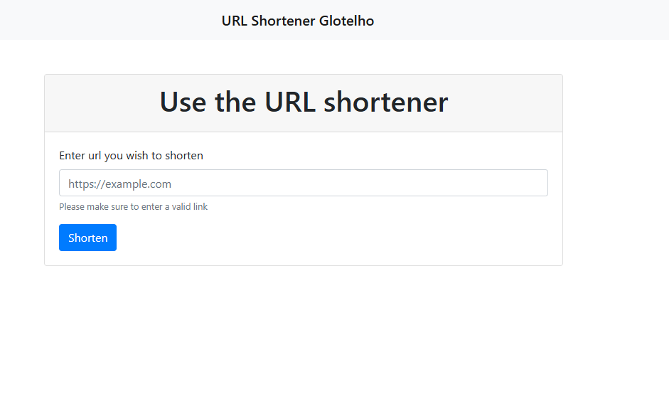
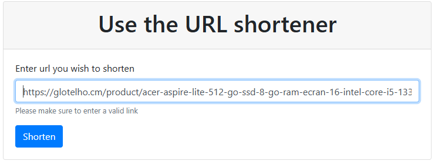
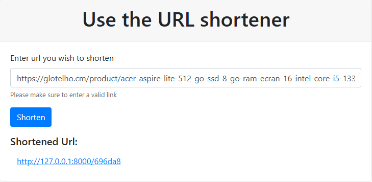
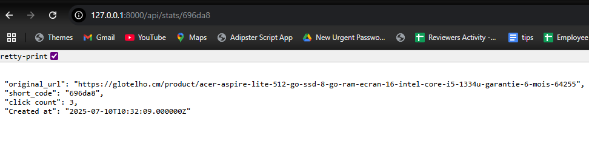

## How to set up the project

This application builds a URL shortener application using Laravel

### Please follow the steps below

- install xampp in your computer. For example in the C drive `C/XAMPP`
- Clone this project into the `htdocs` folder in `C/XAMPP`
- Go to the folder application using cd command on your cmd or terminal
- Run `composer install` on your cmd or terminal
- Copy the contents of `.env.example` file to `.env` on the root folder. 
- Create a database in mysql and name it `glotelhourlshortener`
- Open your `.env` file and uncomment the database configuration and add your database username, password and port
```
DB_CONNECTION=mysql
DB_HOST=127.0.0.1
DB_PORT=3306
DB_DATABASE=glotelhourlshortener
DB_USERNAME=(put your db username here)
DB_PASSWORD=(put your db password here)
```
- Run `php artisan key:generate` in the terminal
- Run `php artisan migrate` to create the database
- Run `php artisan serve` to launch the application and open it in the browser

# Demo
- When you open in the browser, the welcome page should look like this

- Lets try to shorten a link for example `https://glotelho.cm/product/acer-aspire-lite-512-go-ssd-8-go-ram-ecran-16-intel-core-i5-1334u-garantie-6-mois-64255`
- Paste the link in the form as shown below.:

- click on shorten and it should generate a short link as seen below (this calls the POST mehtod `POST /api/shorten` to store it in the database)

- when we click the link, it redirects us to the original website and stores the link in the database (this calls the GET method `GET /{short_code}`)
- if we want to see the stats of the url. we can call the GET method with the shortcode that was generated `696da8`. this request is `GET /api/stats/{short_code}`. 
- Lets call in on the glotelho url we shortened. we get the results below


## core functionality is complete at this point.
